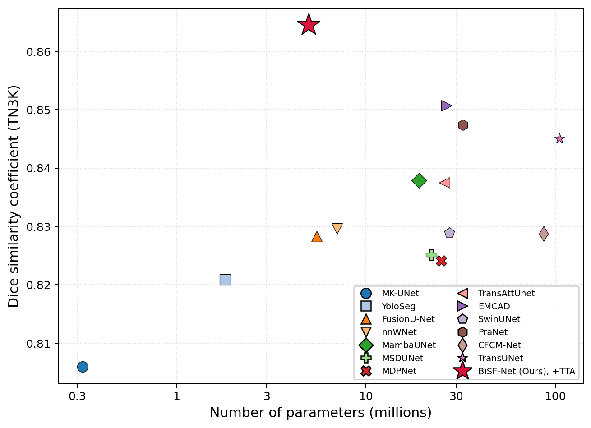
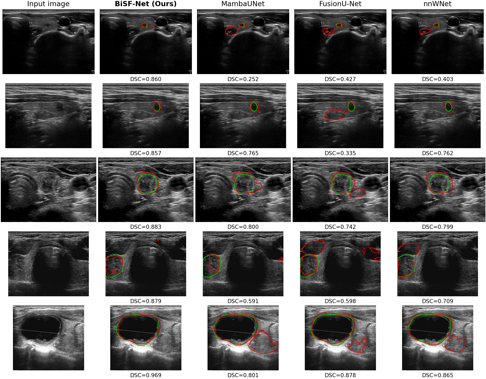

# BiSF-Net: Bidirectional Skip Fusion with Multi-Scale Attention Decoding for Thyroid Nodule Segmentation

BiSF-Net is a **lightweight (4.98 M-parameter), fully-convolutional** encoder–decoder for
thyroid-nodule segmentation in B-mode ultrasound. Despite its small size it attains the
**highest Dice of all fifteen compared models** on TN3K and is the **most robust** to
image-quality degradation, making it well-suited to point-of-care deployment.

This repository contains the **final model, training pipeline, and pretrained weights** that
produced the paper's best results, and reproduces the reported training/test numbers exactly.

---

## 🔑 Results highlights

All models trained under one identical protocol (224×224, AdamW, cosine schedule, early
stopping, seed 42). Baselines are single-forward (std@0.5); **BiSF-Net (Ours)** reports its
best test-time-augmented (TTA) score.

| Benchmark | Metric | BiSF-Net (Ours) | Best baseline |
|---|---|---|---|
| **TN3K** (nodule) | Dice / IoU | **0.8645 / 0.7832** (TTA); 0.8482 / 0.7633 (std) | EMCAD 0.8507 (26.8 M) |
| **DDTI** (nodule) | Dice / IoU | **0.8301 / 0.7301** (TTA); 0.8038 / 0.6949 (std) | EMCAD 0.8368 (26.8 M) |
| **Robustness** (TN3K, severe speckle/blur/contrast) | mean Dice drop ↓ | **0.0256 (best of all)** | TransUNet 0.0282 |
| **Zero-shot transfer** (TN3K→DDTI) | Dice | **0.6323** | best of all compact CNNs by +0.13 |
| **Efficiency** | Params / GFLOPs@224 | **4.98 M / 9.3** | 5–54× smaller than transformer peers |

**Key design ingredient — noise-aware augmentation:** randomly corrupting training images with
speckle/blur/contrast adds **+1.6 Dice** on clean TN3K *and* turns the network from
speckle-sensitive (drop 0.21) into the **most corruption-robust** model (drop 0.026), at zero
parameter cost.

<p align="center"> </p>

---

## 🏗️ Architecture (network token `E0_FullDS`)

- **Encoder:** plain CNN, 5-level feature pyramid, channels `(32, 64, 128, 256, 256)`, max-pool
  downsampling. No transformer, no ImageNet pretraining.
- **Bidirectional Skip Fusion (BSF):** adjacent encoder scales exchange information (fine→coarse
  and coarse→fine) through a lossless pixel-reshuffle operator before the decoder.
- **Multi-Scale attention decoder:** 5 stages, each = channel attention → shared spatial
  attention → Multi-Scale Residual block (parallel depthwise kernels {1,3,5}); element-wise-add skips.
- **Deep supervision:** 6 heads (final + 4 decoder stages + bottleneck), each trained with the
  `structure_loss` (weighted BCE + weighted IoU). Only the finest head is used at inference (no
  test-time cost).
- **Noise-aware augmentation:** random speckle/blur/contrast on training images (mask untouched).

---

## 📦 Repository layout

```
BiSF-Net/
├── train_e0_honest.py     # training entry point (the E0 honest protocol)
├── evaluate.py            # test a checkpoint (std@0.5 and/or TTA)
├── noise_eval.py          # robustness evaluation under simulated degradation
├── dataset_trainval.py    # dataset + noise-aware augmentation
├── mkunet_fullds.py       # BiSF-Net model (E0_FullDS)
├── mkunet_network.py      # attention / MSR building blocks
├── funet/                 # Bidirectional Skip Fusion module
├── tn3k_train.py, mkunet_*.py, tn3k_dataset.py   # supporting utilities/deps
├── checkpoints/
│   ├── bisfnet_tn3k.pt         # best TN3K weights (Dice 0.8482 std / 0.8645 TTA)
│   ├── bisfnet_ddti.pt         # best DDTI weights (Dice 0.8038 std / 0.8301 TTA)
│   └── bisfnet_tn3k_config.json
├── requirements.txt
└── README.md
```

---

## ⚙️ Installation

```bash
conda create -n bisfnet python=3.9 -y && conda activate bisfnet
# install torch matching your CUDA (see https://pytorch.org), then:
pip install -r requirements.txt
```

## 📁 Data preparation

The loaders expect the **TN3K / DDTI** layout below (the public official splits). Point
`--data-root` at the dataset root:

```
<DATA_ROOT>/
├── trainval-image/   trainval-mask/     # training + validation images and binary masks
├── test-image/       test-mask/         # held-out test set
└── tn3k-trainval-fold0.json             # {"train": [...indices...], "val": [...indices...]}
```
Each mask has the **same filename** as its image (`<int>.jpg/.png`) and is binary (0/255,
thresholded at 127). The `fold0` json holds the train/val split indices into the
integer-sorted `trainval-image` list. (DDTI uses the same layout.)

## 🚀 Reproduce training (best model)

```bash
python train_e0_honest.py \
  --data-root  <DATA_ROOT>/TN3K \
  --output-root results --run-name bisfnet_tn3k \
  --network E0_FullDS --batch-size 32 --seed 42 \
  --ds-weights 1.0,1.0,1.0,1.0,1.0,1.0 --size-rates 0.75,1.0,1.25 \
  --noise-aug 0.20
```
This is the exact recipe behind the released checkpoint: AdamW (lr 1e-4, wd 1e-4), cosine
schedule to 1e-7, early stopping (patience 50) on validation Dice, multi-scale training, 6-head
deep supervision, and noise-aware augmentation. The run writes a checkpoint and a
`test_comparison.json` (std + TTA). For DDTI, set `--data-root <DATA_ROOT>/DDTI`.

## 📊 Reproduce test results

```bash
# TN3K, single-forward (expect Dice 0.8482)
python evaluate.py --checkpoint checkpoints/bisfnet_tn3k.pt --data-root <DATA_ROOT>/TN3K
# TN3K, with test-time augmentation (expect Dice ≈ 0.8645)
python evaluate.py --checkpoint checkpoints/bisfnet_tn3k.pt --data-root <DATA_ROOT>/TN3K --tta
# DDTI
python evaluate.py --checkpoint checkpoints/bisfnet_ddti.pt --data-root <DATA_ROOT>/DDTI \
                   --config checkpoints/bisfnet_tn3k_config.json
```

## 🛡️ Robustness evaluation (optional)

`noise_eval.py` re-evaluates a trained run under severe speckle / blur / contrast degradation:
```bash
python noise_eval.py --run-dir results/bisfnet_tn3k --data-root <DATA_ROOT>/TN3K \
                     --degradation all --severity severe --token bisfnet --out robustness_out
```
(`--run-dir` is a training output directory containing `config.json` and
`checkpoints/best_model.pt`.)

---

## 📝 Notes

- `checkpoints/bisfnet_tn3k.pt` stores `{"model_state": ...}`; load with `strict=False`.
- The headline TTA number (0.8645) uses 8-way flip/rotation × multi-scale best-ensemble with a
  validation-tuned threshold, as produced by `train_e0_honest.py`; `evaluate.py --tta` uses the
  same ensemble at threshold 0.5.
- Trained/tested with `torch 2.6.0`, `timm 1.0.22` on an NVIDIA H200.

## Citation

```bibtex
@article{kanwal_bisfnet,
  title  = {BiSF-Net: Bidirectional Skip Fusion with Multi-Scale Attention Decoding
            for Thyroid Nodule Segmentation in Ultrasound},
  author = {Kanwal, Mehreen and Park, Seungun and Son, Yunsik},
  year   = {2026}
}
```
